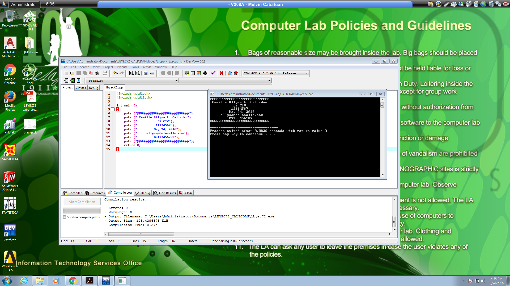

# HellofromCalicdan

Hello world repository

```
#include <stdio.h>
#include <stdlib.h>

int main ()
{
    puts("\n\n\t@@@@@@@@@@@@@@@@@@@@@@@@@@@@@\n");
    puts("\n\t   Camille Allysa L. Calicdan");
    puts("\n\t             BS CIV");
    puts("\n\t            11234567");
    puts("\n\t          May 24, 2016");
    puts("\n\t      allysa@delasalle.com");  
    puts("\n\t          09123456789\n");     
    puts("\n\t@@@@@@@@@@@@@@@@@@@@@@@@@@@@@\n");
    return 0;
}

```



```
#include <stdio.h>
#include <math.h>

int main ()
{
	float b, h, area;
	printf ("Enter the base of the triangle: \n");
	scanf ("%f", &b);
       printf ("Enter the height of the triangle: \n");
	scanf ("%f", &h);

	area = 0.5*b*h;
	printf ("Area of triangle is: %2f.\n", area);
	
	return 0;
}
```


```
#include <stdio.h>

int main ()
{
	int a, age;
	puts ("Enter birth year:");
	scanf ("%d", &a);
	
	age = (2016-a);
	printf ("Your age is: %d \n", age);
	
	return 0;
}
```


```
#include <stdio.h>

int main ()
{
	int x, y;
	puts ("Enter value of x:");
	scanf ("%d", &x);
	
	y=x/70;
	printf ("F(x) =  %d \n", y);
	
	return 0;
}
```

